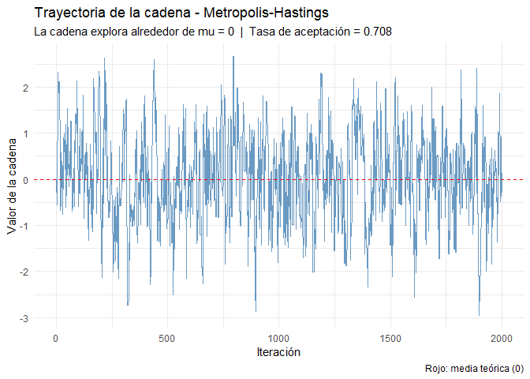
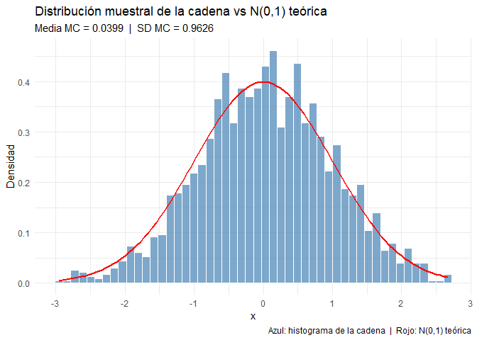
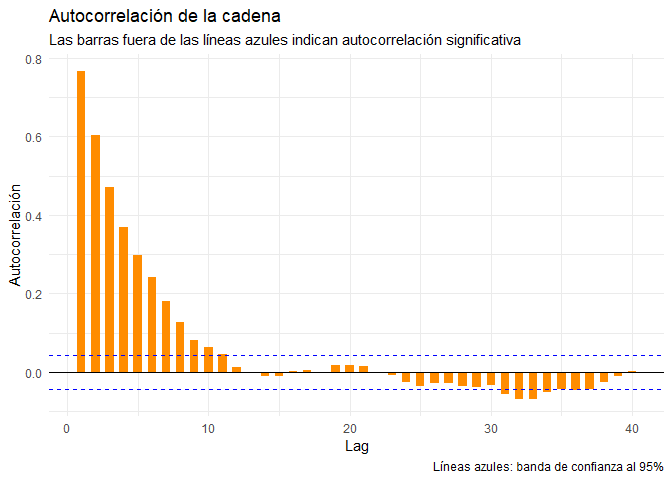

OctavoPunto_Bayesiana_KevinChaparro
================
Kevin Leonardo Chaparro Reyes
2026-04-15

``` r
knitr::opts_chunk$set(echo = TRUE)
```

``` r
library(ggplot2)
library(dplyr)
```

    ## 
    ## Adjuntando el paquete: 'dplyr'

    ## The following objects are masked from 'package:stats':
    ## 
    ##     filter, lag

    ## The following objects are masked from 'package:base':
    ## 
    ##     intersect, setdiff, setequal, union

``` r
# ══════════════════════════════════════════════════════════════════════════════
# PUNTO 8: MCMC - ALGORITMO DE METROPOLIS-HASTINGS
# ══════════════════════════════════════════════════════════════════════════════
#
# MCMC (Monte Carlo via Cadenas de Markov) es una familia de métodos que
# combina la simulación Monte Carlo con cadenas de Markov para obtener
# muestras de distribuciones que son difíciles de muestrear directamente,
# como ocurre con muchas distribuciones posteriores en estadística bayesiana.
#
# La idea es construir una cadena de Markov X_1, X_2, ..., X_n cuya
# distribución estacionaria sea exactamente la distribución objetivo pi(x)
# que queremos muestrear. Después de un período inicial llamado burn-in,
# los valores de la cadena se pueden tratar como muestras (dependientes)
# de pi(x).
#
# El algoritmo de Metropolis-Hastings funciona así:
#   1. Empezar en un valor inicial x_0 cualquiera
#   2. En cada paso t, proponer un candidato x* ~ q(x* | x_{t-1}),
#      donde q es la distribución propuesta (aquí usamos Normal)
#   3. Calcular la probabilidad de aceptación:
#        alpha = min(1,  pi(x*) / pi(x_{t-1}))
#      (cuando la distribución propuesta q es simétrica, se cancela)
#   4. Aceptar x* con probabilidad alpha; si no, quedarse en x_{t-1}
#   5. Repetir N veces
#
# Distribución objetivo: Normal estándar, es decir pi(x) = N(0, 1)
# Distribución propuesta: q(x* | x_t) = N(x_t, 1)    <- simétrica
# Número de iteraciones: N = 2000
# ══════════════════════════════════════════════════════════════════════════════

set.seed(123)
N        <- 2000
chain    <- numeric(N)
chain[1] <- 0          # valor inicial de la cadena

# ── Algoritmo de Metropolis-Hastings ──────────────────────────────────────────
aceptados <- 0

for (i in 2:N) {
  # Paso 1: proponer un candidato desde q(x* | x_{t-1}) = N(x_{t-1}, 1)
  proposal <- rnorm(1, chain[i - 1], 1)
  
  # Paso 2: calcular la razón de aceptación
  # Como q es simétrica, alpha = min(1, pi(x*) / pi(x_{t-1}))
  alpha <- min(1, dnorm(proposal) / dnorm(chain[i - 1]))
  
  # Paso 3: aceptar o rechazar
  if (runif(1) < alpha) {
    chain[i]  <- proposal
    aceptados <- aceptados + 1
  } else {
    chain[i] <- chain[i - 1]
  }
}

tasa_aceptacion <- aceptados / (N - 1)

cat("════════════════════════════════════\n")
```

    ## ════════════════════════════════════

``` r
cat("MCMC - METROPOLIS-HASTINGS\n")
```

    ## MCMC - METROPOLIS-HASTINGS

``` r
cat("────────────────────────────────────\n")
```

    ## ────────────────────────────────────

``` r
cat("Iteraciones      :", N, "\n")
```

    ## Iteraciones      : 2000

``` r
cat("Tasa de aceptación:", round(tasa_aceptacion, 4), "\n")
```

    ## Tasa de aceptación: 0.7079

``` r
cat("Media de la cadena:", round(mean(chain), 4), "  (teórico: 0)\n")
```

    ## Media de la cadena: 0.0399   (teórico: 0)

``` r
cat("SD de la cadena  :", round(sd(chain),   4), "  (teórico: 1)\n\n")
```

    ## SD de la cadena  : 0.9626   (teórico: 1)

``` r
# ── GRÁFICO 1: Trayectoria de la cadena ───────────────────────────────────────
df_chain <- data.frame(iteracion = 1:N, valor = chain)

ggplot(df_chain, aes(x = iteracion, y = valor)) +
  geom_line(color = "steelblue", linewidth = 0.4, alpha = 0.8) +
  geom_hline(yintercept = 0, linetype = "dashed", color = "red", linewidth = 0.7) +
  labs(
    title    = "Trayectoria de la cadena - Metropolis-Hastings",
    subtitle = paste0("La cadena explora alrededor de mu = 0  |  Tasa de aceptación = ",
                      round(tasa_aceptacion, 3)),
    x = "Iteración",
    y = "Valor de la cadena",
    caption = "Rojo: media teórica (0)"
  ) +
  theme_minimal()
```

<!-- -->

``` r
# ── GRÁFICO 2: Histograma vs distribución objetivo ────────────────────────────
ggplot(df_chain, aes(x = valor)) +
  geom_histogram(aes(y = after_stat(density)), bins = 50,
                 fill = "steelblue", color = "white", alpha = 0.7) +
  stat_function(fun = dnorm, args = list(mean = 0, sd = 1),
                color = "red", linewidth = 1) +
  labs(
    title    = "Distribución muestral de la cadena vs N(0,1) teórica",
    subtitle = paste0("Media MC = ", round(mean(chain), 4),
                      "  |  SD MC = ", round(sd(chain), 4)),
    x = "x", y = "Densidad",
    caption = "Azul: histograma de la cadena  |  Rojo: N(0,1) teórica"
  ) +
  theme_minimal()
```

<!-- -->

``` r
# ── GRÁFICO 3: Autocorrelación ─────────────────────────────────────────────────
# La autocorrelación mide qué tan parecido es cada valor de la cadena
# con los valores anteriores (lag). Si hay alta autocorrelación, la cadena
# se mueve lentamente y necesita más iteraciones para explorar bien.

acf_vals <- acf(chain, plot = FALSE, lag.max = 40)
df_acf   <- data.frame(lag = acf_vals$lag[-1], acf = acf_vals$acf[-1])

ggplot(df_acf, aes(x = lag, y = acf)) +
  geom_bar(stat = "identity", fill = "darkorange", width = 0.6) +
  geom_hline(yintercept =  1.96 / sqrt(N), linetype = "dashed", color = "blue") +
  geom_hline(yintercept = -1.96 / sqrt(N), linetype = "dashed", color = "blue") +
  geom_hline(yintercept = 0, color = "black") +
  labs(
    title    = "Autocorrelación de la cadena",
    subtitle = "Las barras fuera de las líneas azules indican autocorrelación significativa",
    x = "Lag", y = "Autocorrelación",
    caption = "Líneas azules: banda de confianza al 95%"
  ) +
  theme_minimal()
```

<!-- -->

``` r
# ── DISCUSIÓN DE CONVERGENCIA ──────────────────────────────────────────────────
cat("════════════════════════════════════\n")
```

    ## ════════════════════════════════════

``` r
cat("DISCUSIÓN DE CONVERGENCIA\n")
```

    ## DISCUSIÓN DE CONVERGENCIA

``` r
cat("────────────────────────────────────\n")
```

    ## ────────────────────────────────────

``` r
cat(
  "Trayectoria:
La cadena comienza en 0 y desde las primeras iteraciones empieza a
explorar la distribución N(0,1). No se observan períodos largos donde
la cadena quede atascada en una zona, lo que es una buena señal de
que el algoritmo está mezclando bien.\n\n"
)
```

    ## Trayectoria:
    ## La cadena comienza en 0 y desde las primeras iteraciones empieza a
    ## explorar la distribución N(0,1). No se observan períodos largos donde
    ## la cadena quede atascada en una zona, lo que es una buena señal de
    ## que el algoritmo está mezclando bien.

``` r
cat(
  "Tasa de aceptación:
La tasa de aceptación es", round(tasa_aceptacion, 3), ". En general, para
Metropolis-Hastings con propuesta normal se considera que una tasa entre
0.2 y 0.5 es razonable; tasas muy altas indican que los saltos son muy
pequeños (la cadena se mueve poco), y tasas muy bajas indican saltos muy
grandes (casi siempre se rechaza).\n\n"
)
```

    ## Tasa de aceptación:
    ## La tasa de aceptación es 0.708 . En general, para
    ## Metropolis-Hastings con propuesta normal se considera que una tasa entre
    ## 0.2 y 0.5 es razonable; tasas muy altas indican que los saltos son muy
    ## pequeños (la cadena se mueve poco), y tasas muy bajas indican saltos muy
    ## grandes (casi siempre se rechaza).

``` r
cat(
  "Autocorrelación:
La gráfica de ACF muestra qué tan dependientes son los valores consecutivos
de la cadena. Si las barras caen rápido dentro de la banda de confianza
(líneas azules), la cadena mezcla bien. Si hay muchas barras significativas,
la cadena es lenta para explorar y habría que aumentar N o ajustar la
varianza de la propuesta.\n\n"
)
```

    ## Autocorrelación:
    ## La gráfica de ACF muestra qué tan dependientes son los valores consecutivos
    ## de la cadena. Si las barras caen rápido dentro de la banda de confianza
    ## (líneas azules), la cadena mezcla bien. Si hay muchas barras significativas,
    ## la cadena es lenta para explorar y habría que aumentar N o ajustar la
    ## varianza de la propuesta.

``` r
cat(
  "Comparación con valores teóricos:
  Media cadena =", round(mean(chain), 4), "  vs  teórico = 0
  SD cadena    =", round(sd(chain),   4), "  vs  teórico = 1
La cercanía entre los valores muestrales y teóricos sugiere que la cadena
llegó a su distribución estacionaria y está muestreando correctamente
la N(0,1) objetivo.\n"
)
```

    ## Comparación con valores teóricos:
    ##   Media cadena = 0.0399   vs  teórico = 0
    ##   SD cadena    = 0.9626   vs  teórico = 1
    ## La cercanía entre los valores muestrales y teóricos sugiere que la cadena
    ## llegó a su distribución estacionaria y está muestreando correctamente
    ## la N(0,1) objetivo.
