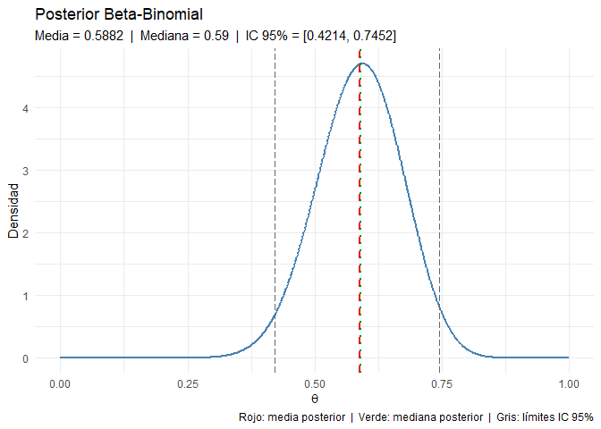
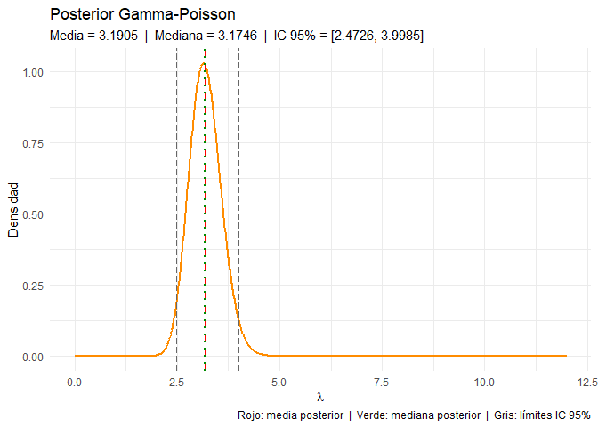
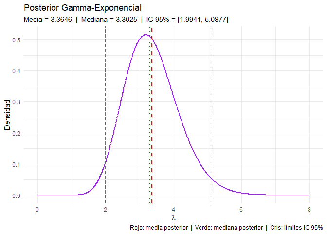

PrimerPunto_Bayesiana_KevinChaparro
================
Kevin Leonardo Chaparro Reyes
2026-04-15

``` r
knitr::opts_chunk$set(echo = TRUE)
```

``` r
library(ggplot2)
library(dplyr)
```

    ## 
    ## Adjuntando el paquete: 'dplyr'

    ## The following objects are masked from 'package:stats':
    ## 
    ##     filter, lag

    ## The following objects are masked from 'package:base':
    ## 
    ##     intersect, setdiff, setequal, union

``` r
# ══════════════════════════════════════════════════════════════════════════════
# MODELO 1: BETA-BINOMIAL
# ══════════════════════════════════════════════════════════════════════════════
#
# Sea X el número de éxitos observados en n ensayos de Bernoulli independientes,
# donde cada ensayo tiene probabilidad de éxito theta, con theta desconocido
# y theta en (0, 1).
#
# Modelo:
#   X | theta ~ Binomial(n, theta)
#   theta     ~ Beta(a, b)          <- distribución a priori
#
# Como la prior Beta es conjugada con la verosimilitud Binomial, la posterior
# también es Beta y sus parámetros se actualizan directamente con los datos:
#
#   theta | X = x  ~  Beta(a + x,  b + n - x)
#
# Datos: n = 30 ensayos, x = 18 éxitos
# Hiperparámetros: a = 2, b = 2  (prior centrada en 0.5, poco informativa)
# ══════════════════════════════════════════════════════════════════════════════

set.seed(123)
n = 30
x = 18
a = 2
b = 2

# Parámetros de la posterior
post_a = a + x
post_b = b + n - x

# Grid para graficar la densidad posterior
theta      <- seq(0, 1, length = 1000)
posterior  <- dbeta(theta, post_a, post_b)

# Estimadores puntuales e intervalo de credibilidad
media_bb   = post_a / (post_a + post_b)
mediana_bb = qbeta(0.5, post_a, post_b)
ic_bb      = qbeta(c(0.025, 0.975), post_a, post_b)

# Gráfico
df_bb = data.frame(theta = theta, densidad = posterior)

ggplot(df_bb, aes(x = theta, y = densidad)) +
  geom_line(color = "steelblue", linewidth = 1) +
  geom_vline(xintercept = media_bb,   linetype = "dashed",   color = "red",    linewidth = 0.8) +
  geom_vline(xintercept = mediana_bb, linetype = "dotted",   color = "green4", linewidth = 0.8) +
  geom_vline(xintercept = ic_bb[1],   linetype = "longdash", color = "gray40") +
  geom_vline(xintercept = ic_bb[2],   linetype = "longdash", color = "gray40") +
  labs(
    title    = "Posterior Beta-Binomial",
    subtitle = paste0("Media = ", round(media_bb, 4),
                      "  |  Mediana = ", round(mediana_bb, 4),
                      "  |  IC 95% = [", round(ic_bb[1], 4), ", ", round(ic_bb[2], 4), "]"),
    x = expression(theta),
    y = "Densidad",
    caption = "Rojo: media posterior  |  Verde: mediana posterior  |  Gris: límites IC 95%"
  ) +
  theme_minimal()
```

<!-- -->

``` r
# Resultados e interpretación
cat("════════════════════════════════════\n")
```

    ## ════════════════════════════════════

``` r
cat("MODELO 1: BETA-BINOMIAL\n")
```

    ## MODELO 1: BETA-BINOMIAL

``` r
cat("Posterior: Beta(", post_a, ",", post_b, ")\n")
```

    ## Posterior: Beta( 20 , 14 )

``` r
cat("────────────────────────────────────\n")
```

    ## ────────────────────────────────────

``` r
cat("Media posterior   :", round(media_bb,   4), "\n")
```

    ## Media posterior   : 0.5882

``` r
cat("Mediana posterior :", round(mediana_bb, 4), "\n")
```

    ## Mediana posterior : 0.59

``` r
cat("IC 95% creíble    : [", round(ic_bb[1], 4), ",", round(ic_bb[2], 4), "]\n")
```

    ## IC 95% creíble    : [ 0.4214 , 0.7452 ]

``` r
cat("Diferencia (media - mediana):", round(media_bb - mediana_bb, 6), "\n")
```

    ## Diferencia (media - mediana): -0.00175

``` r
cat("────────────────────────────────────\n")
```

    ## ────────────────────────────────────

``` r
cat(
  "La diferencia entre media y mediana es muy pequeña, lo que indica que
la posterior es bastante simétrica. En este caso, los dos estimadores
bayesianos dan resultados casi iguales: si usamos pérdida cuadrática (L2)
estimamos con la media, y si usamos pérdida absoluta (L1) con la mediana,
pero prácticamente coinciden. El intervalo de credibilidad del 95% nos
dice que, dado lo observado, theta está entre",
  round(ic_bb[1], 4), "y", round(ic_bb[2], 4),
  "con probabilidad 0.95 según la posterior.\n\n"
)
```

    ## La diferencia entre media y mediana es muy pequeña, lo que indica que
    ## la posterior es bastante simétrica. En este caso, los dos estimadores
    ## bayesianos dan resultados casi iguales: si usamos pérdida cuadrática (L2)
    ## estimamos con la media, y si usamos pérdida absoluta (L1) con la mediana,
    ## pero prácticamente coinciden. El intervalo de credibilidad del 95% nos
    ## dice que, dado lo observado, theta está entre 0.4214 y 0.7452 con probabilidad 0.95 según la posterior.

``` r
# ══════════════════════════════════════════════════════════════════════════════
# MODELO 2: GAMMA-POISSON
# ══════════════════════════════════════════════════════════════════════════════
#
# Sean X_1, X_2, ..., X_n variables aleatorias independientes e idénticamente
# distribuidas que representan conteos de eventos en un intervalo fijo,
# con tasa desconocida lambda > 0.
#
# Modelo:
#   X_i | lambda  ~iid  Poisson(lambda),   i = 1, ..., n
#   lambda        ~      Gamma(alpha, beta)  <- prior conjugada (parametrización por tasa)
#
# Como la prior Gamma es conjugada con la verosimilitud Poisson, la posterior
# también es Gamma y sus parámetros se actualizan así:
#
#   lambda | x_1, ..., x_n  ~  Gamma(alpha + sum(x_i),  beta + n)
#
# Datos: n = 20 observaciones simuladas
# Hiperparámetros: alpha = 2, beta = 1
# ══════════════════════════════════════════════════════════════════════════════

set.seed(123)
n_p     =20
datos_p = rpois(n_p, lambda = 3)

alpha0_p = 2
beta0_p  = 1

# Parámetros de la posterior
post_alpha_p = alpha0_p + sum(datos_p)
post_beta_p  = beta0_p  + n_p

# Grid para graficar la densidad posterior
lambda_grid = seq(0, 12, length = 1000)
posterior_p = dgamma(lambda_grid, shape = post_alpha_p, rate = post_beta_p)

# Estimadores puntuales e intervalo de credibilidad
media_gp   = post_alpha_p / post_beta_p
mediana_gp = qgamma(0.5,          shape = post_alpha_p, rate = post_beta_p)
ic_gp      = qgamma(c(0.025, 0.975), shape = post_alpha_p, rate = post_beta_p)

# Gráfico
df_gp = data.frame(lambda = lambda_grid, densidad = posterior_p)

ggplot(df_gp, aes(x = lambda, y = densidad)) +
  geom_line(color = "darkorange", linewidth = 1) +
  geom_vline(xintercept = media_gp,   linetype = "dashed",   color = "red",    linewidth = 0.8) +
  geom_vline(xintercept = mediana_gp, linetype = "dotted",   color = "green4", linewidth = 0.8) +
  geom_vline(xintercept = ic_gp[1],   linetype = "longdash", color = "gray40") +
  geom_vline(xintercept = ic_gp[2],   linetype = "longdash", color = "gray40") +
  labs(
    title    = "Posterior Gamma-Poisson",
    subtitle = paste0("Media = ", round(media_gp, 4),
                      "  |  Mediana = ", round(mediana_gp, 4),
                      "  |  IC 95% = [", round(ic_gp[1], 4), ", ", round(ic_gp[2], 4), "]"),
    x = expression(lambda),
    y = "Densidad",
    caption = "Rojo: media posterior  |  Verde: mediana posterior  |  Gris: límites IC 95%"
  ) +
  theme_minimal()
```

<!-- -->

``` r
# Resultados e interpretación
cat("════════════════════════════════════\n")
```

    ## ════════════════════════════════════

``` r
cat("MODELO 2: GAMMA-POISSON\n")
```

    ## MODELO 2: GAMMA-POISSON

``` r
cat("Posterior: Gamma(", post_alpha_p, ",", post_beta_p, ") [tasa]\n")
```

    ## Posterior: Gamma( 67 , 21 ) [tasa]

``` r
cat("────────────────────────────────────\n")
```

    ## ────────────────────────────────────

``` r
cat("Media posterior   :", round(media_gp,   4), "\n")
```

    ## Media posterior   : 3.1905

``` r
cat("Mediana posterior :", round(mediana_gp, 4), "\n")
```

    ## Mediana posterior : 3.1746

``` r
cat("IC 95% creíble    : [", round(ic_gp[1], 4), ",", round(ic_gp[2], 4), "]\n")
```

    ## IC 95% creíble    : [ 2.4726 , 3.9985 ]

``` r
cat("Diferencia (media - mediana):", round(media_gp - mediana_gp, 6), "\n")
```

    ## Diferencia (media - mediana): 0.015859

``` r
cat("────────────────────────────────────\n")
```

    ## ────────────────────────────────────

``` r
cat(
  "La distribución Gamma tiene una ligera asimetría hacia la derecha, así que
la media queda un poco por encima de la mediana. Esto se ve en la diferencia
que calculamos arriba. Si usamos pérdida cuadrática (L2) el estimador óptimo
es la media, y bajo pérdida absoluta (L1) es la mediana; en este caso la
mediana es algo más conservadora porque no se deja arrastrar por la cola
derecha de la distribución. A medida que n crece, la posterior se vuelve
más simétrica y esta diferencia tiende a reducirse.\n\n"
)
```

    ## La distribución Gamma tiene una ligera asimetría hacia la derecha, así que
    ## la media queda un poco por encima de la mediana. Esto se ve en la diferencia
    ## que calculamos arriba. Si usamos pérdida cuadrática (L2) el estimador óptimo
    ## es la media, y bajo pérdida absoluta (L1) es la mediana; en este caso la
    ## mediana es algo más conservadora porque no se deja arrastrar por la cola
    ## derecha de la distribución. A medida que n crece, la posterior se vuelve
    ## más simétrica y esta diferencia tiende a reducirse.

``` r
# ══════════════════════════════════════════════════════════════════════════════
# MODELO 3: GAMMA-EXPONENCIAL
# ══════════════════════════════════════════════════════════════════════════════
#
# Sean X_1, X_2, ..., X_n variables aleatorias independientes e idénticamente
# distribuidas que representan tiempos de espera entre eventos,
# con tasa desconocida lambda > 0.
#
# Modelo:
#   X_i | lambda  ~iid  Exponencial(lambda),   i = 1, ..., n
#   lambda        ~      Gamma(alpha, beta)      <- prior conjugada (parametrización por tasa)
#
# Como la prior Gamma es conjugada con la verosimilitud Exponencial, la posterior
# también es Gamma y sus parámetros se actualizan así:
#
#   lambda | x_1, ..., x_n  ~  Gamma(alpha + n,  beta + sum(x_i))
#
# Datos: n = 15 observaciones simuladas
# Hiperparámetros: alpha = 3, beta = 1
# ══════════════════════════════════════════════════════════════════════════════

set.seed(123)
n_e     = 15
datos_e = rexp(n_e, rate = 2)

alpha0_e = 3
beta0_e  = 1

# Parámetros de la posterior
post_alpha_e = alpha0_e + n_e
post_beta_e  = beta0_e  + sum(datos_e)

# Grid para graficar la densidad posterior
lambda_grid_e = seq(0, 8, length = 1000)
posterior_e   = dgamma(lambda_grid_e, shape = post_alpha_e, rate = post_beta_e)

# Estimadores puntuales e intervalo de credibilidad
media_ge   = post_alpha_e / post_beta_e
mediana_ge = qgamma(0.5,          shape = post_alpha_e, rate = post_beta_e)
ic_ge      = qgamma(c(0.025, 0.975), shape = post_alpha_e, rate = post_beta_e)

# Gráfico
df_ge = data.frame(lambda = lambda_grid_e, densidad = posterior_e)

ggplot(df_ge, aes(x = lambda, y = densidad)) +
  geom_line(color = "purple", linewidth = 1) +
  geom_vline(xintercept = media_ge,   linetype = "dashed",   color = "red",    linewidth = 0.8) +
  geom_vline(xintercept = mediana_ge, linetype = "dotted",   color = "green4", linewidth = 0.8) +
  geom_vline(xintercept = ic_ge[1],   linetype = "longdash", color = "gray40") +
  geom_vline(xintercept = ic_ge[2],   linetype = "longdash", color = "gray40") +
  labs(
    title    = "Posterior Gamma-Exponencial",
    subtitle = paste0("Media = ", round(media_ge, 4),
                      "  |  Mediana = ", round(mediana_ge, 4),
                      "  |  IC 95% = [", round(ic_ge[1], 4), ", ", round(ic_ge[2], 4), "]"),
    x = expression(lambda),
    y = "Densidad",
    caption = "Rojo: media posterior  |  Verde: mediana posterior  |  Gris: límites IC 95%"
  ) +
  theme_minimal()
```

<!-- -->

``` r
# Resultados e interpretación
cat("════════════════════════════════════\n")
```

    ## ════════════════════════════════════

``` r
cat("MODELO 3: GAMMA-EXPONENCIAL\n")
```

    ## MODELO 3: GAMMA-EXPONENCIAL

``` r
cat("Posterior: Gamma(", post_alpha_e, ",", post_beta_e, ") [tasa]\n")
```

    ## Posterior: Gamma( 18 , 5.349878 ) [tasa]

``` r
cat("────────────────────────────────────\n")
```

    ## ────────────────────────────────────

``` r
cat("Media posterior   :", round(media_ge,   4), "\n")
```

    ## Media posterior   : 3.3646

``` r
cat("Mediana posterior :", round(mediana_ge, 4), "\n")
```

    ## Mediana posterior : 3.3025

``` r
cat("IC 95% creíble    : [", round(ic_ge[1], 4), ",", round(ic_ge[2], 4), "]\n")
```

    ## IC 95% creíble    : [ 1.9941 , 5.0877 ]

``` r
cat("Diferencia (media - mediana):", round(media_ge - mediana_ge, 6), "\n")
```

    ## Diferencia (media - mediana): 0.062097

``` r
cat("────────────────────────────────────\n")
```

    ## ────────────────────────────────────

``` r
cat(
  "Al igual que en el modelo Gamma-Poisson, la posterior Gamma tiene
asimetría hacia la derecha, lo que hace que la media sea mayor que la
mediana. Bajo pérdida L2 usamos la media como estimador óptimo, y bajo
pérdida L1 usamos la mediana. El intervalo de credibilidad del 95% nos
dice que, dada la información de los datos, el valor de lambda está en
ese rango con probabilidad 0.95 según la posterior. Esto es distinto a
un intervalo de confianza frecuentista, donde la probabilidad se refiere
a la cobertura en muestras repetidas, no al parámetro directamente.\n\n"
)
```

    ## Al igual que en el modelo Gamma-Poisson, la posterior Gamma tiene
    ## asimetría hacia la derecha, lo que hace que la media sea mayor que la
    ## mediana. Bajo pérdida L2 usamos la media como estimador óptimo, y bajo
    ## pérdida L1 usamos la mediana. El intervalo de credibilidad del 95% nos
    ## dice que, dada la información de los datos, el valor de lambda está en
    ## ese rango con probabilidad 0.95 según la posterior. Esto es distinto a
    ## un intervalo de confianza frecuentista, donde la probabilidad se refiere
    ## a la cobertura en muestras repetidas, no al parámetro directamente.
