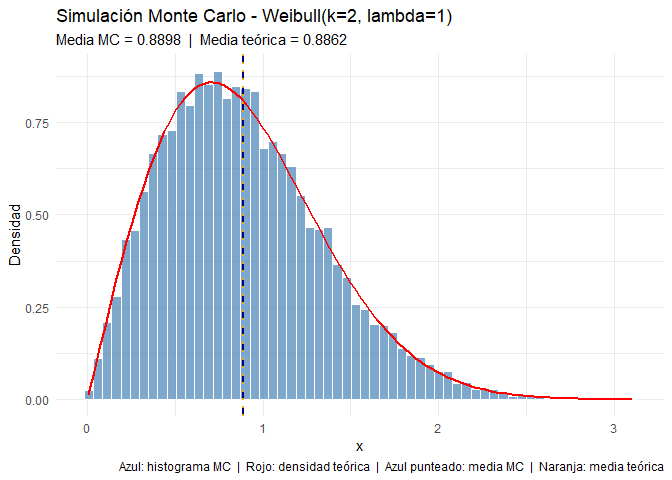
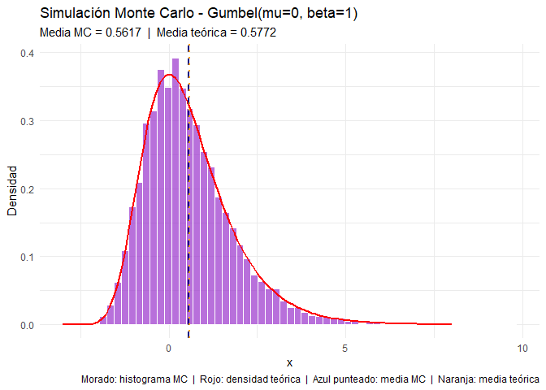

SeptimoPunto_Bayesiana_KevinChaparro
================
Kevin Leonardo Chaparro Reyes
2026-04-15

``` r
knitr::opts_chunk$set(echo = TRUE)
```

``` r
library(ggplot2)
library(dplyr)
```

    ## 
    ## Adjuntando el paquete: 'dplyr'

    ## The following objects are masked from 'package:stats':
    ## 
    ##     filter, lag

    ## The following objects are masked from 'package:base':
    ## 
    ##     intersect, setdiff, setequal, union

``` r
# ══════════════════════════════════════════════════════════════════════════════
# PUNTO 7: SIMULACIÓN MONTE CARLO
# ══════════════════════════════════════════════════════════════════════════════
#
# El método de Monte Carlo consiste en aproximar cantidades de interés
# (como esperanza y varianza) generando un número grande de valores
# aleatorios de una distribución y calculando los estadísticos sobre
# esas muestras. La idea es que, por la ley de los grandes números,
# los promedios muestrales convergen a los valores teóricos a medida
# que el número de simulaciones crece.
#
# Una cadena de Markov es una sucesión de variables aleatorias
# X_1, X_2, ..., X_n tal que el estado futuro X_{t+1} depende
# únicamente del estado actual X_t, y no de los estados anteriores.
# Esta propiedad se conoce como la propiedad de Markov o de "falta
# de memoria". En el contexto bayesiano, los métodos MCMC usan cadenas
# de Markov para explorar distribuciones posteriores complejas.
# ══════════════════════════════════════════════════════════════════════════════
```

``` r
# ══════════════════════════════════════════════════════════════════════════════
# SIMULACIÓN 1: DISTRIBUCIÓN WEIBULL
# ══════════════════════════════════════════════════════════════════════════════
#
# Sea X una variable aleatoria con distribución Weibull de parámetros
# shape = k y scale = lambda. Su función de densidad es:
#
#   f(x) = (k/lambda) * (x/lambda)^(k-1) * exp(-(x/lambda)^k),   x > 0
#
# Los valores teóricos de esperanza y varianza son:
#
#   E[X]   = lambda * Gamma(1 + 1/k)
#   Var[X] = lambda^2 * [ Gamma(1 + 2/k) - (Gamma(1 + 1/k))^2 ]
#
# Usamos k = 2 y lambda = 1, por lo tanto:
#   E[X]   = Gamma(1.5) = sqrt(pi)/2  ≈ 0.8862
#   Var[X] = Gamma(2) - Gamma(1.5)^2 = 1 - pi/4  ≈ 0.2146
#
# Se generan N = 10000 muestras para aproximar estos valores via MC.
# ══════════════════════════════════════════════════════════════════════════════

set.seed(123)
N       = 10000
k       = 2
lambda  = 1

# Simulación Monte Carlo
x_weibull = rweibull(N, shape = k, scale = lambda)

# Estimaciones MC
media_mc_w  = mean(x_weibull)
var_mc_w    = var(x_weibull)

# Valores teóricos
media_teo_w = lambda * gamma(1 + 1/k)
var_teo_w   = lambda^2 * (gamma(1 + 2/k) - gamma(1 + 1/k)^2)

# Gráfico
df_w = data.frame(x = x_weibull)

ggplot(df_w, aes(x = x)) +
  geom_histogram(aes(y = after_stat(density)), bins = 60,
                 fill = "steelblue", color = "white", alpha = 0.7) +
  stat_function(fun = dweibull, args = list(shape = k, scale = lambda),
                color = "red", linewidth = 1) +
  geom_vline(xintercept = media_mc_w,  linetype = "dashed", color = "navy",   linewidth = 0.8) +
  geom_vline(xintercept = media_teo_w, linetype = "dotted", color = "orange", linewidth = 0.8) +
  labs(
    title    = "Simulación Monte Carlo - Weibull(k=2, lambda=1)",
    subtitle = paste0("Media MC = ", round(media_mc_w, 4),
                      "  |  Media teórica = ", round(media_teo_w, 4)),
    x = "x", y = "Densidad",
    caption = "Azul: histograma MC  |  Rojo: densidad teórica  |  Azul punteado: media MC  |  Naranja: media teórica"
  ) +
  theme_minimal()
```

<!-- -->

``` r
# Resultados e interpretación
cat("════════════════════════════════════\n")
```

    ## ════════════════════════════════════

``` r
cat("SIMULACIÓN 1: WEIBULL(k=2, lambda=1)\n")
```

    ## SIMULACIÓN 1: WEIBULL(k=2, lambda=1)

``` r
cat("────────────────────────────────────\n")
```

    ## ────────────────────────────────────

``` r
cat("              MC         Teórico\n")
```

    ##               MC         Teórico

``` r
cat("Esperanza :  ", round(media_mc_w,  4), "     ", round(media_teo_w, 4), "\n")
```

    ## Esperanza :   0.8898       0.8862

``` r
cat("Varianza  :  ", round(var_mc_w,    4), "     ", round(var_teo_w,   4), "\n")
```

    ## Varianza  :   0.2124       0.2146

``` r
cat("────────────────────────────────────\n")
```

    ## ────────────────────────────────────

``` r
cat(
  "Las estimaciones Monte Carlo de la esperanza y la varianza se acercan
bastante a los valores teóricos con N = 10000 muestras. La pequeña
diferencia que queda se debe al error de simulación, que disminuye
a medida que N aumenta. Esto muestra que el método MC funciona bien
para aproximar estas cantidades cuando la distribución es conocida.\n\n"
)
```

    ## Las estimaciones Monte Carlo de la esperanza y la varianza se acercan
    ## bastante a los valores teóricos con N = 10000 muestras. La pequeña
    ## diferencia que queda se debe al error de simulación, que disminuye
    ## a medida que N aumenta. Esto muestra que el método MC funciona bien
    ## para aproximar estas cantidades cuando la distribución es conocida.

``` r
# ══════════════════════════════════════════════════════════════════════════════
# SIMULACIÓN 2: DISTRIBUCIÓN GUMBEL
# ══════════════════════════════════════════════════════════════════════════════
#
# Sea U ~ Uniforme(0,1). Aplicando la función cuantil de la distribución
# Gumbel estándar (mu = 0, beta = 1) obtenemos:
#
#   G = -log(-log(U))  ~  Gumbel(mu = 0, beta = 1)
#
# Los valores teóricos de esperanza y varianza para Gumbel(0, 1) son:
#
#   E[G]   = mu + beta * gamma_EM  =  gamma_EM  ≈  0.5772
#            donde gamma_EM es la constante de Euler-Mascheroni
#
#   Var[G] = (pi^2 / 6) * beta^2  =  pi^2 / 6  ≈  1.6449
#
# Se generan N = 10000 muestras para aproximar estos valores via MC.
# ══════════════════════════════════════════════════════════════════════════════

set.seed(123)
u         = runif(N)
g_gumbel  = -log(-log(u))

# Estimaciones MC
media_mc_g  = mean(g_gumbel)
var_mc_g    = var(g_gumbel)

# Valores teóricos
gamma_EM    = 0.5772156649   # constante de Euler-Mascheroni
media_teo_g = gamma_EM
var_teo_g   = pi^2 / 6

# Gráfico
df_g = data.frame(x = g_gumbel)

# Densidad teórica de Gumbel(0,1): f(x) = exp(-(x + exp(-x)))
dgumbel = function(x) exp(-(x + exp(-x)))

ggplot(df_g, aes(x = x)) +
  geom_histogram(aes(y = after_stat(density)), bins = 60,
                 fill = "darkorchid", color = "white", alpha = 0.7) +
  stat_function(fun = dgumbel, color = "red", linewidth = 1, xlim = c(-3, 8)) +
  geom_vline(xintercept = media_mc_g,  linetype = "dashed", color = "navy",   linewidth = 0.8) +
  geom_vline(xintercept = media_teo_g, linetype = "dotted", color = "orange", linewidth = 0.8) +
  labs(
    title    = "Simulación Monte Carlo - Gumbel(mu=0, beta=1)",
    subtitle = paste0("Media MC = ", round(media_mc_g, 4),
                      "  |  Media teórica = ", round(media_teo_g, 4)),
    x = "x", y = "Densidad",
    caption = "Morado: histograma MC  |  Rojo: densidad teórica  |  Azul punteado: media MC  |  Naranja: media teórica"
  ) +
  theme_minimal()
```

<!-- -->

``` r
# Resultados e interpretación
cat("════════════════════════════════════\n")
```

    ## ════════════════════════════════════

``` r
cat("SIMULACIÓN 2: GUMBEL(mu=0, beta=1)\n")
```

    ## SIMULACIÓN 2: GUMBEL(mu=0, beta=1)

``` r
cat("────────────────────────────────────\n")
```

    ## ────────────────────────────────────

``` r
cat("              MC         Teórico\n")
```

    ##               MC         Teórico

``` r
cat("Esperanza :  ", round(media_mc_g,  4), "     ", round(media_teo_g, 4), "\n")
```

    ## Esperanza :   0.5617       0.5772

``` r
cat("Varianza  :  ", round(var_mc_g,    4), "     ", round(var_teo_g,   4), "\n")
```

    ## Varianza  :   1.6069       1.6449

``` r
cat("────────────────────────────────────\n")
```

    ## ────────────────────────────────────

``` r
cat(
  "De nuevo, las estimaciones MC se acercan bien a los valores teóricos.
La Gumbel tiene asimetría positiva (cola hacia la derecha), lo que hace
que su media teórica sea la constante de Euler-Mascheroni (~0.5772) y
su varianza teórica sea pi^2/6 (~1.6449). El histograma refleja bien
esa forma asimétrica, y los valores MC confirman que la simulación
está capturando correctamente el comportamiento de la distribución.\n\n"
)
```

    ## De nuevo, las estimaciones MC se acercan bien a los valores teóricos.
    ## La Gumbel tiene asimetría positiva (cola hacia la derecha), lo que hace
    ## que su media teórica sea la constante de Euler-Mascheroni (~0.5772) y
    ## su varianza teórica sea pi^2/6 (~1.6449). El histograma refleja bien
    ## esa forma asimétrica, y los valores MC confirman que la simulación
    ## está capturando correctamente el comportamiento de la distribución.

``` r
# ══════════════════════════════════════════════════════════════════════════════
# RESUMEN COMPARATIVO
# ══════════════════════════════════════════════════════════════════════════════

cat("════════════════════════════════════════════════════════════\n")
```

    ## ════════════════════════════════════════════════════════════

``` r
cat("RESUMEN: Monte Carlo vs Valores Teóricos\n")
```

    ## RESUMEN: Monte Carlo vs Valores Teóricos

``` r
cat("────────────────────────────────────────────────────────────\n")
```

    ## ────────────────────────────────────────────────────────────

``` r
cat(sprintf("%-20s %-12s %-12s %-12s\n", "Distribución", "Estadístico", "MC", "Teórico"))
```

    ## Distribución        Estadístico MC           Teórico

``` r
cat("────────────────────────────────────────────────────────────\n")
```

    ## ────────────────────────────────────────────────────────────

``` r
cat(sprintf("%-20s %-12s %-12s %-12s\n", "Weibull(2,1)", "Esperanza",
            round(media_mc_w, 4), round(media_teo_w, 4)))
```

    ## Weibull(2,1)         Esperanza    0.8898       0.8862

``` r
cat(sprintf("%-20s %-12s %-12s %-12s\n", "",             "Varianza",
            round(var_mc_w,   4), round(var_teo_w,   4)))
```

    ##                      Varianza     0.2124       0.2146

``` r
cat(sprintf("%-20s %-12s %-12s %-12s\n", "Gumbel(0,1)",  "Esperanza",
            round(media_mc_g, 4), round(media_teo_g, 4)))
```

    ## Gumbel(0,1)          Esperanza    0.5617       0.5772

``` r
cat(sprintf("%-20s %-12s %-12s %-12s\n", "",             "Varianza",
            round(var_mc_g,   4), round(var_teo_g,   4)))
```

    ##                      Varianza     1.6069       1.6449

``` r
cat("════════════════════════════════════════════════════════════\n")
```

    ## ════════════════════════════════════════════════════════════
